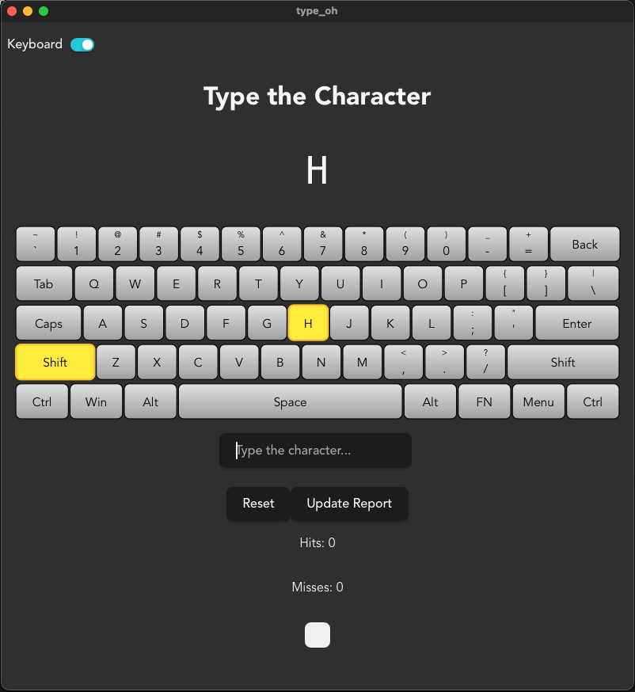

# Type-Oh - Typing Practice Application



Type-Oh is a toy, typing practice application created as an exercise to tinker with Tauri and Leptos.

This app helps&trade; users improve their typing
speed and accuracy by presenting random ASCII characters to type while tracking statistics.

## Features

- **Random Character Practice**: Displays random ASCII characters for focused typing practice
- **Real-time Statistics**: Tracks hits, misses, and reaction times with millisecond precision
- **Visual Keyboard**: Toggle-able SVG keyboard that highlights the keys you need to press
- **Detailed Reports**: Generate HTML reports showing per-character statistics including:
    - Hit count and miss count
    - Minimum, maximum, and average reaction times
    - Performance trends over time
- **Auto-submission**: Automatically processes input as soon as you type a character
- **Reset Functionality**: Clear all statistics and start fresh
- **Desktop Application**: Native desktop app with modern UI

## Technology Stack

- **Frontend**: Leptos 0.8 with Client-Side Rendering (CSR)
- **Backend**: Tauri 2.0 for native desktop functionality
- **Language**: Rust (latest stable)
- **Build System**: Trunk for frontend bundling
- **Statistics**: Chrono for timestamp handling, comprehensive tracking system

## Prerequisites

Before running Type Oh, ensure you have the following installed:

- [Rust toolchain](https://rustup.rs/) (latest stable)
- [Tauri CLI](https://tauri.app/v1/guides/getting-started/prerequisites): `cargo install tauri-cli`
- [Trunk](https://trunkrs.dev/): `cargo install trunk`

## Installation & Setup

1. **Clone the repository**:
   ```bash
   git clone <repository-url>
   cd type_oh
   ```

2. **Install dependencies**:
   ```bash
   # Ensure you have the WASM target installed
   rustup target add wasm32-unknown-unknown
   ```

3. **Run in development mode**:
   ```bash
   cargo tauri dev
   ```

   **Important**: Always use `cargo tauri dev` to run the application, NOT `cargo run`.

## Usage

1. **Start the application** using `cargo tauri dev`
2. **Focus on the input field** (it auto-focuses on startup)
3. **Type the displayed character** - the app will automatically process your input
4. **Toggle the keyboard view** using the checkbox to see visual key highlights
5. **View statistics** by clicking "Update Report" to see performance metrics
6. **Reset progress** using the "Reset" button to clear all statistics

## Building for Production

```bash
# Build release version with native bundles
cargo tauri build

# Frontend only (generates dist/ directory)
trunk build
```

## Project Structure

```
type_oh/
├── src/                    # Frontend Leptos/WASM code
│   ├── app.rs             # Main application logic and UI
│   ├── stats.rs           # Statistics tracking system
│   ├── ascii_chars.rs     # ASCII character enum and utilities
│   ├── timer.rs           # Reaction time measurement
│   ├── svg_keyboard.rs    # Visual keyboard component
│   └── common.rs          # Shared utilities
├── src-tauri/             # Tauri backend (native app wrapper)
├── dist/                  # Built frontend assets
├── public/                # Static assets
└── type_oh.png           # Application screenshot
```

## Development

### Running Tests

```bash
# Run all tests
cargo test

# Run tests with verbose output
cargo test -- --nocapture

# Run specific test module
cargo test stats::tests
```

### Key Components

- **Statistics System**: Tracks performance metrics with timestamps
- **Visual Keyboard**: SVG-based keyboard that highlights keys to press
- **Timer System**: Measures reaction times with millisecond precision
- **ASCII Character System**: Comprehensive enum for all typeable characters

### Development Commands

```bash
# Development mode (recommended)
cargo tauri dev

# Frontend development only
trunk serve

# Run tests
cargo test

# Check code
cargo check
```

## Contributing is welcome

1. Fork the repository
2. Create a feature branch
3. Make your changes
4. Add tests for new functionality
5. Ensure all tests pass with `cargo test`
6. Submit a pull request

## License

This project is licensed under the MIT License - see the [LICENSE_MIT](LICENSE_MIT) file for details.

## Troubleshooting

### Common Issues

- **"cargo run doesn't work"**: Use `cargo tauri dev` instead
- **WASM compilation errors**: Ensure you have the WASM target: `rustup target add wasm32-unknown-unknown`
- **Trunk not found**: Install with `cargo install trunk`
- **Frontend not loading**: Make sure Trunk is building the frontend properly

### System Requirements

- Modern desktop operating system (Windows, macOS, Linux)
- Rust toolchain (latest stable recommended)
- Sufficient memory for WASM compilation

---

**Type Oh** - Improve your typing skills with precision and style! 🚀
